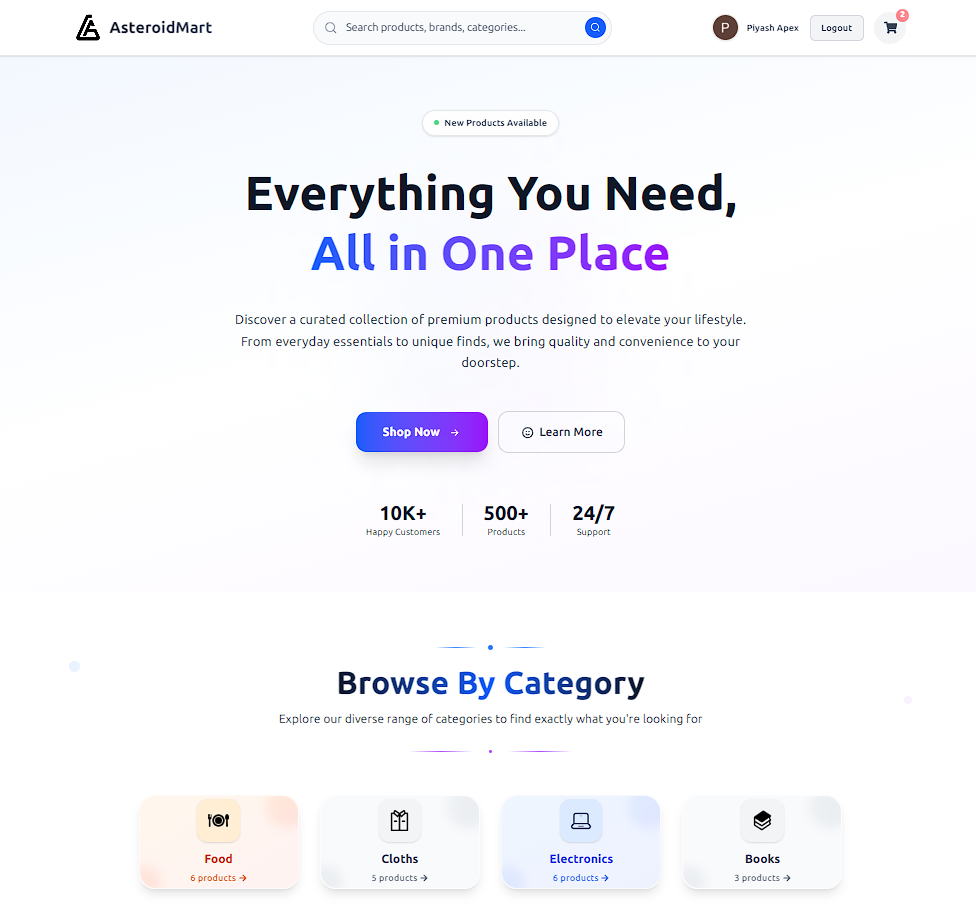

# 🛸 AsteroidMart - Full-Stack E-commerce Platform

A modern, responsive e-commerce platform built with Next.js frontend and Django REST API backend. AsteroidMart provides a complete shopping experience with user authentication, product management, cart functionality, and secure payments.



## ✨ Features

### 🛍️ **Shopping Experience**
- **Product Catalog** - Browse products by categories with advanced filtering
- **Product Search** - Intelligent search functionality with real-time results
- **Product Details** - Comprehensive product information with image galleries
- **Shopping Cart** - Persistent cart with quantity management
- **Wishlist** - Save favorite products for later
- **User Reviews & Ratings** - Customer feedback system

### 🔐 **User Management**
- **Authentication** - Secure login/signup with NextAuth.js
- **User Profiles** - Personal account management
- **Order History** - Track past purchases
- **Address Management** - Multiple shipping addresses

### 💳 **Payment & Orders**
- **Stripe Integration** - Secure payment processing
- **Order Management** - Complete order lifecycle
- **Order Tracking** - Real-time order status updates

### 🎨 **Modern UI/UX**
- **Responsive Design** - Mobile-first approach
- **Dark/Light Mode** - Theme customization
- **Smooth Animations** - Enhanced user experience
- **Accessibility** - WCAG compliant design

## 🚀 Tech Stack

### Frontend
- **Framework**: Next.js 15.5.0 with App Router
- **Language**: TypeScript
- **Styling**: Tailwind CSS 4.0
- **UI Components**: Radix UI primitives
- **Authentication**: NextAuth.js
- **State Management**: React Context API
- **HTTP Client**: Axios
- **Icons**: Lucide React & React Icons

### Backend
- **Framework**: Django 5.2.5 with Django REST Framework
- **Database**: PostgreSQL (Production) / SQLite (Development)
- **Authentication**: Django Custom User Model
- **File Storage**: Cloudinary (Production) / Local (Development)
- **Payment**: Stripe API
- **CORS**: Django CORS Headers

## 🛠️ Installation & Setup

### Prerequisites
- Node.js 18+ 
- Python 3.8+
- PostgreSQL (for production)

### Frontend Setup

1. **Clone the repository**
   ```bash
   git clone https://github.com/Piyash1/AsTeroidMart.git
   cd AsteroidMart
   ```

2. **Install dependencies**
   ```bash
   npm install
   # or
   yarn install
   # or
   pnpm install
   ```

3. **Environment Variables**
   Create a `.env.local` file in the frontend directory:
   ```env
   NEXT_PUBLIC_BACKEND_BASE_URL=http://localhost:8000
   NEXT_PUBLIC_MEDIA_BASE_URL=https://res.cloudinary.com/your-cloud-name/image/upload/
   NEXTAUTH_SECRET=your-nextauth-secret
   NEXTAUTH_URL=http://localhost:3000
   ```

4. **Run the development server**
   ```bash
   npm run dev
   # or
   yarn dev
   # or
   pnpm dev
   ```

5. **Open your browser**
   Navigate to [http://localhost:3000](http://localhost:3000)

### Backend Setup

1. **Navigate to backend directory**
   ```bash
   cd ../backend
   ```

2. **Create virtual environment**
   ```bash
   python -m venv env
   source env/bin/activate  # On Windows: env\Scripts\activate
   ```

3. **Install dependencies**
   ```bash
   pip install -r requirements.txt
   ```

4. **Environment Variables**
   Create a `.env` file in the backend directory:
   ```env
   SECRET_KEY=your-django-secret-key
   DEBUG=True
   ENVIRONMENT=development
   DATABASE_URL=sqlite:///db.sqlite3
   CLOUDINARY_CLOUD_NAME=your-cloudinary-name
   CLOUDINARY_API_KEY=your-cloudinary-key
   CLOUDINARY_API_SECRET=your-cloudinary-secret
   STRIPE_SECRETE_KEY=your-stripe-secret-key
   STRIPE_PUBLISHABLE_KEY=your-stripe-publishable-key
   ```

5. **Run migrations**
   ```bash
   python manage.py migrate
   ```

6. **Create superuser**
   ```bash
   python manage.py createsuperuser
   ```

7. **Start the development server**
   ```bash
   python manage.py runserver
   ```

## 📁 Project Structure

```
frontend/
├── app/                    # Next.js App Router
│   ├── api/               # API routes
│   ├── cart/              # Cart pages
│   ├── categories/        # Category pages
│   ├── products/          # Product pages
│   └── profile/           # User profile
├── components/            # Reusable components
│   ├── cart/             # Cart components
│   ├── home/             # Homepage components
│   ├── navbar/           # Navigation components
│   ├── productDetail/    # Product detail components
│   └── ui/               # UI primitives
├── context/              # React Context providers
├── lib/                  # Utility functions
├── public/               # Static assets
└── types/                # TypeScript type definitions
```

## 🎯 Key Features Implementation

### Smart Image URL Handling
The application intelligently handles both local and Cloudinary image URLs:
```typescript
export const getImageUrl = (imagePath: string | null | undefined): string => {
  if (!imagePath) return placeholder;
  if (imagePath.startsWith('http')) return imagePath;
  if (imagePath.includes('image/upload/')) {
    const baseUrl = MEDIA_BASE_URL.replace('/image/upload/', '');
    return `${baseUrl}/${imagePath}`;
  }
  return `${MEDIA_BASE_URL}${imagePath}`;
};
```

### Responsive Design
- Mobile-first approach with Tailwind CSS
- Breakpoint-specific layouts
- Touch-friendly interactions
- Optimized images with Next.js Image component

### Performance Optimizations
- Next.js App Router for better performance
- Image optimization with Cloudinary
- Lazy loading for components
- Efficient state management

## 🚀 Deployment

### Frontend (Vercel)
1. Connect your GitHub repository to Vercel
2. Set environment variables in Vercel dashboard
3. Deploy automatically on push to main branch

### Backend (Railway/Render)
1. Connect your repository
2. Set environment variables
3. Configure database (PostgreSQL)
4. Deploy

## 🤝 Contributing

1. Fork the repository
2. Create a feature branch (`git checkout -b feature/amazing-feature`)
3. Commit your changes (`git commit -m 'Add some amazing feature'`)
4. Push to the branch (`git push origin feature/amazing-feature`)
5. Open a Pull Request

## 📝 License

This project is licensed under the MIT License - see the [LICENSE](LICENSE) file for details.

## 🙏 Acknowledgments

- [Next.js](https://nextjs.org/) - The React framework
- [Django](https://djangoproject.com/) - The web framework
- [Tailwind CSS](https://tailwindcss.com/) - CSS framework
- [Radix UI](https://www.radix-ui.com/) - UI primitives
- [Stripe](https://stripe.com/) - Payment processing
- [Cloudinary](https://cloudinary.com/) - Image management

---

**Built with ❤️ by [Moniruzzaman Piyash]**

For support, email asteroidexo@gmail.com or create an issue in this repository.